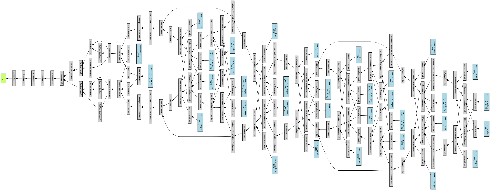
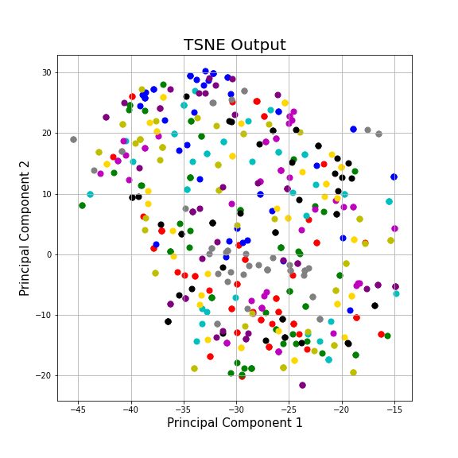

# Self-and-Semi-Supervised-Learning
A demonstration of self and semi supervised learning on the [STL-10 dataset](https://cs.stanford.edu/~acoates/stl10/). The [Barlow Twins](https://arxiv.org/abs/2103.03230) method which based on contrastive learning was used for self-supervised learning where a CNN-based model was trained completely on unlabeled data. Pseudo labeling was used for semi-supervised learning where the model was trained on both labeled and unlabeled data.

## Implementations:
**Note:**<br>
***The folder that contains the STL-10 dataset(~5GB) has been shared([link](https://drive.google.com/drive/folders/1eYHHjeDKr8SFjjxcnAtumztYlL4PIJ2a?usp=sharing)). Add a shortcut of the same to the "My Drive" section in your google drive to run all the ipython notebooks in your google colaboratory.***

### 1. Supervised_Learning:<br>
[Supervised_Learning.ipynb]((Supervised_Learning.ipynb)) notebook uses supervised learning to classify the STL-10 i.e. 5000 labeled images, 500 per class. A Resnet9 architecture was used for the same. 

Results: 
### 
    Train Accuracy: 96.92 %
    Test Accuracy: 73.32 %


### 2. Self-Supervised Learning:<br>
In the [ResNet9_Barlow_Twins.ipynb](ResNet9_Barlow_Twins.ipynb) notebook we are extracting 500 labelled images from the the training set for self-supervised learning using the Barlow Twins method. Using labeled data sounds counter-intuitive but **we are not using the labels in the training of the network**, we are only using them for the tSNE/PCA visualization of the embedding vectors after every epoch. 

**Model**:<br>
The backbone chosen for this task was the Resnet9 architecture. The last classsifier layer was removed and a dense fc layer was attached to give a 128 dimensional embedding vector output. 


As seen in the image, Barlow Twins requires 2 augmentations of the same image to be propagated through the model simulataneously in one computational step. This requires parameter sharing for back propogation as reflected by the image.

**Pipeline**:<br>
1. Augmentations:<br>
    a. RandomHorizontalFlip<br>
    b. RandomRotation<br>
    c. GaussianBlur<br>
    d. RandomSolarize<br>
    e. ColorJitter<br>
    Hyperparameters for these augmentations were taken from the original work of [Barlow Twins](https://arxiv.org/abs/2103.03230).

2. Implmented pseudo-code for training from this [link](https://lilianweng.github.io/lil-log/2021/05/31/contrastive-representation-learning.html#parallel-augmentation).

3. Visulazing the embedding vectors:<br>
Created two functions for visualizing 100 and 500 embedding vectors using PCA and tSNE methods of the *sklearn* library. The inputs are the current batch and the labels for the same. Called in the training function for visualization and analysis after every epoch. The results of the same are available [here](Results/Self_supervised).


**Issue Faced:**<br>
The model and the training function compiled and trained on ~13 epochs successfully, however subsequently the loss abruptly becomes ```nan```. This in turn was occuring due to the gradient becoming ```nan```.

**Debugging:**<br>

1. **torch.autograd.set_detect_anomaly(True)** was used to trace what part of the code was causing there to be ```nan``` values.

2. **Error was traced to be:** *RuntimeError: Function 'PowBackward0' returned nan values in its 0th output.*

3. A simpler model (AlexNet) was used in the [AlexNet_Barlow_Twins.ipynb](AlexNet_Barlow_Twins.ipynb) notebook. The error persisted.

4. Gradient clipping was used to ensure that the gradients do not explode. Division by zero was also prevented at all stages by adding a small positive constant wherever required.

5. We also tried using Facebook research's [implementation](https://github.com/facebookresearch/barlowtwins) of the Barlow Twins loss function and the LARS optimizer.

### 3. Semi-Supervised Learning:<br>
Pseudo Labeling was used to use both labeled and unlabeled data simultaneously for training in the [Pseudo_Labelling.ipynb](Pseudo_Labelling.ipynb) notebook. We first tried on 1000 labeled and 2000 unlabeled images. This led to an increasing loss and reduced accuracy with respect to supervised learning. When we tried increasing the dataset to 5000 labeled and 20,000 unlabeled images we ran out of GPU resources.
However, we observed a steady increase in loss and an accuracy of 78% on the test set for the limited number epochs we were able to train.
